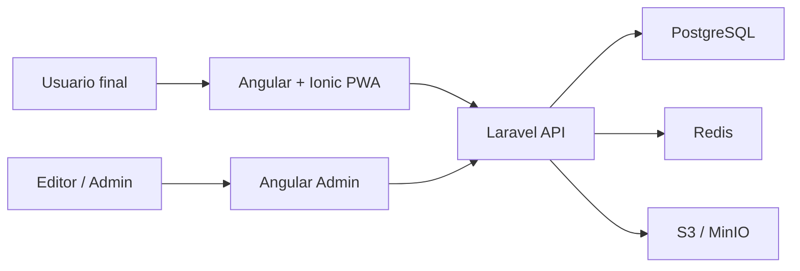
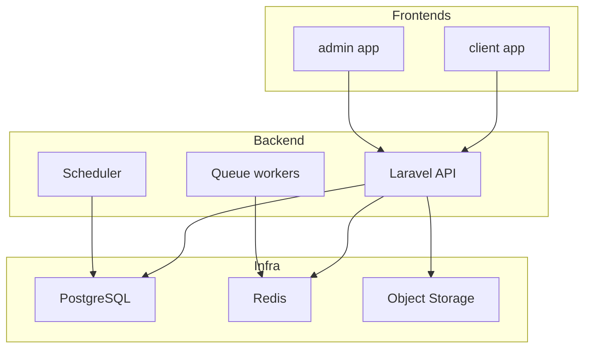
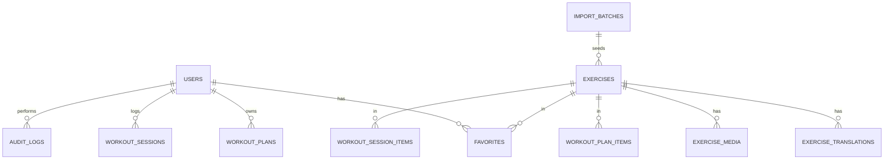
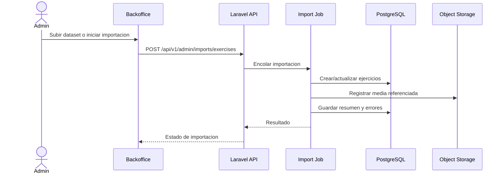

# Arquitectura detallada

## Visión general

La plataforma se compone de tres superficies principales:

- `backend`: API Laravel
- `client`: app PWA con Angular + Ionic
- `admin`: backoffice Angular

Servicios de soporte:

- PostgreSQL para datos transaccionales
- Redis para cache, jobs y colas
- S3 compatible para imagenes y GIFs
- Mailpit para desarrollo local

## Diagrama de contexto

## Diagrama de contenedores

## Modelo de dominio

## Flujo de importacion

## Estrategia de persistencia

### Tablas principales

- `users`
- `roles`
- `permissions`
- `exercises`
- `exercise_translations`
- `exercise_media`
- `taxonomy_terms`
- `favorites`
- `workout_plans`
- `workout_plan_items`
- `workout_sessions`
- `workout_session_items`
- `audit_logs`
- `import_batches`

### Decisiones de modelado

- `exercises` guarda el registro canónico del ejercicio.
- `exercise_translations` guarda texto e instrucciones por locale.
- `exercise_media` separa imagen, GIF y metadata de licencia.
- `taxonomy_terms` centraliza opciones reutilizables para filtros y selectores.
- `audit_logs` registra acciones administrativas relevantes.

## Contratos de API

### Autenticacion

- `POST /api/v1/auth/login`
- `POST /api/v1/auth/logout`
- `GET /api/v1/me`

### Catalogo

- `GET /api/v1/exercises`
- `GET /api/v1/exercises/{id}`
- `GET /api/v1/taxonomies`

### Usuario final

- `POST /api/v1/favorites`
- `DELETE /api/v1/favorites/{id}`
- `POST /api/v1/workout-plans`
- `POST /api/v1/workout-sessions`

### Backoffice

- `GET /api/v1/admin/exercises`
- `POST /api/v1/admin/exercises`
- `PATCH /api/v1/admin/exercises/{id}`
- `POST /api/v1/admin/imports/exercises`
- `GET /api/v1/admin/audit-logs`

## Consideraciones tecnicas

- El API debe versionarse desde el inicio con `/api/v1`.
- Los filtros de catalogo deben resolverse en PostgreSQL para el MVP.
- Las imagenes y GIFs deben almacenarse fuera del repositorio.
- La importacion del dataset debe ser idempotente.
- El backoffice no debe escribir directamente al mismo tiempo que el importador sin control de estados.

