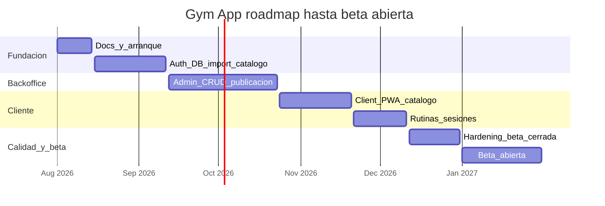

# Roadmap gym-app

Fuente viva del calendario de desarrollo.

- Capacidad: 1 persona + Cursor/agente
- Cadencia: sprints de 2 semanas
- Objetivo de producto: MVP de entrenamiento (catalogo, favoritos, rutinas simples, sesiones, backoffice editorial)
- **Beta abierta: enero 2027**
- Beta cerrada: 12–31 diciembre 2026

El plan de producto largo vive en [`../plan-app-entrenamiento.md`](../plan-app-entrenamiento.md). Este archivo manda para fechas y orden de ejecucion.

## Vision del calendario

## Principios de ritmo (solo)

- Prioridad: backend usable → admin minimo → client PWA → calidad → betas.
- Un sprint, un objetivo principal. No abrir tres frentes a la vez.
- Si un sprint se atrasa, recortar scope del siguiente antes de mover la beta abierta.
- Feature freeze de producto nuevo desde el inicio de la beta cerrada (12 dic 2026), salvo P0.

## Fuera de alcance hasta despues de la beta abierta

- Recomendaciones con IA
- Wearables
- Pagos / marketplace
- Social feed
- Video en vivo
- Gamificacion avanzada

## Fases y sprints

### Sprint 0 — Docs y arranque

| | |
|---|---|
| Fechas | 1–14 ago 2026 |
| Objetivo | Entorno reproducible y documentacion lista para programar |
| Done when | README operativo, getting-started validado, Compose arriba, backend conecta a Postgres |

Entregables:

- README, getting-started, roadmap, beta-plan, convenciones
- `.env` de backend apuntando a Postgres del Compose
- Smoke test: `GET /api/v1/health`

### Sprints 1–2 — Fundacion API

| | |
|---|---|
| Fechas | 15 ago – 11 sep 2026 |
| Objetivo | Auth, dominio de ejercicios e importacion del dataset |
| Done when | Login Sanctum, roles sembrados, catalogo listable con filtros, import idempotente |

Sprint 1 (15–28 ago):

- Sanctum end-to-end
- Roles y permisos (seeders)
- Middleware / policies basicas
- Usuario admin de prueba

Sprint 2 (29 ago – 11 sep):

- Migraciones core estables
- Modelos ejercicios / traducciones / media / taxonomias
- Importador `exercises-dataset` idempotente
- `GET /exercises`, detalle, taxonomias, filtros y paginacion

### Sprints 3–5 — Backoffice v1

| | |
|---|---|
| Fechas | 12 sep – 23 oct 2026 |
| Objetivo | Operar el catalogo sin tocar codigo |
| Done when | Un editor puede crear, editar, publicar y subir media desde el admin |

Sprint 3 (12–25 sep):

- Scaffold real Angular admin
- Login admin contra API
- Shell / layout / routing

Sprint 4 (26 sep – 9 oct):

- CRUD de ejercicios
- Edicion de traducciones
- Estados `draft` / `review` / `published` / `archived`

Sprint 5 (10–23 oct):

- Carga de imagen y GIF (MinIO)
- Taxonomias en UI
- Auditoria basica
- Importacion masiva controlada desde admin

### Sprints 6–7 — Cliente PWA v1

| | |
|---|---|
| Fechas | 24 oct – 20 nov 2026 |
| Objetivo | Experiencia usuario final sobre el catalogo |
| Done when | Usuario puede buscar, ver detalle, favoritos y login en mobile-first / PWA |

Sprint 6 (24 oct – 6 nov):

- Scaffold real Angular + Ionic
- Home, listado, busqueda y filtros
- Detalle de ejercicio con media

Sprint 7 (7–20 nov):

- Favoritos
- Login / registro basico
- Selector de idioma
- Persistencia de sesion

### Sprint 8 — Rutinas y sesiones

| | |
|---|---|
| Fechas | 21 nov – 11 dic 2026 |
| Objetivo | Valor de entrenamiento real (no solo catalogo) |
| Done when | Usuario crea una rutina simple y registra al menos una sesion |

Entregables:

- CRUD basico de workout plans
- Registro de workout session
- Historial minimo
- Ajustes de API cliente necesarios

### Sprint 9 — Beta cerrada

| | |
|---|---|
| Fechas | 12–31 dic 2026 |
| Objetivo | Estabilizar y validar con invitados |
| Done when | Checklist de [`beta-plan.md`](beta-plan.md) cumplido con 5–15 testers |

Entregables:

- Pruebas E2E manuales
- Hardening de permisos
- Staging desplegado
- Correcciones UX criticas
- Documentacion operativa minima

### Enero 2027 — Beta abierta

| | |
|---|---|
| Fechas | 1–31 ene 2027 |
| Objetivo | Abrir registro controlado y aprender del uso real |
| Done when | Criterios de salida de beta abierta en [`beta-plan.md`](beta-plan.md) |

Entregables:

- Onboarding / landing minimo
- Monitoreo y logs basicos
- Canal de feedback
- Solo bugs y P0; sin features nuevas de alcance MVP+

## Hitos

| ID | Hito | Fecha objetivo |
|----|------|----------------|
| H0 | Docs y entorno listos | 14 ago 2026 |
| H1 | API catalogo + import estables | 11 sep 2026 |
| H2 | Backoffice usable por contenido | 23 oct 2026 |
| H3 | Cliente PWA navegable | 20 nov 2026 |
| H4 | Rutinas y sesiones en MVP | 11 dic 2026 |
| H5 | Beta cerrada lanzada | 12 dic 2026 |
| H6 | Beta abierta lanzada | 1 ene 2027 |

## Criterios de exito del MVP

- El catalogo carga sin errores tras importar `exercises-dataset`
- Un editor publica ejercicios sin soporte tecnico
- Un usuario busca, guarda favoritos, arma una rutina y registra una sesion
- Consultas de listado estables en local/staging
- Cambios administrativos quedan auditados

## Como usar este roadmap

1. Al iniciar cada sprint, copiar el objetivo a issues/tareas concretas (ver [`backlog.md`](backlog.md)).
2. Al cerrar el sprint, marcar done o mover deuda explicita al siguiente.
3. Si hay que renegociar fechas, actualizar este archivo primero y luego el backlog.
